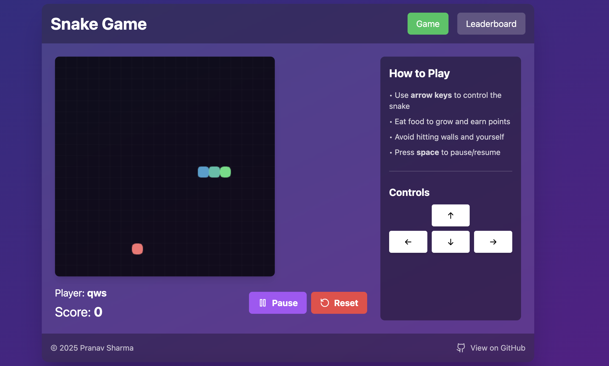
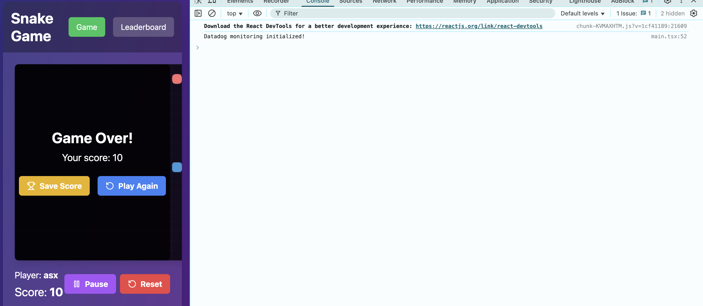
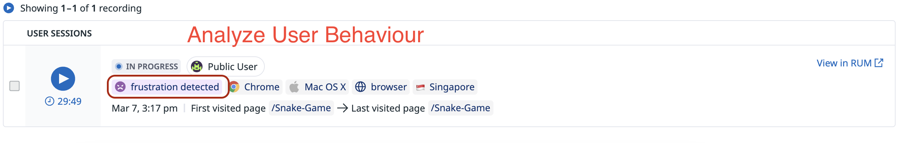
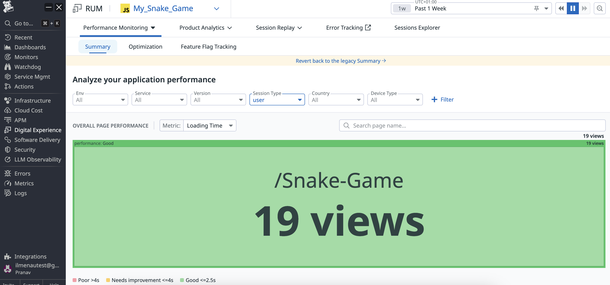
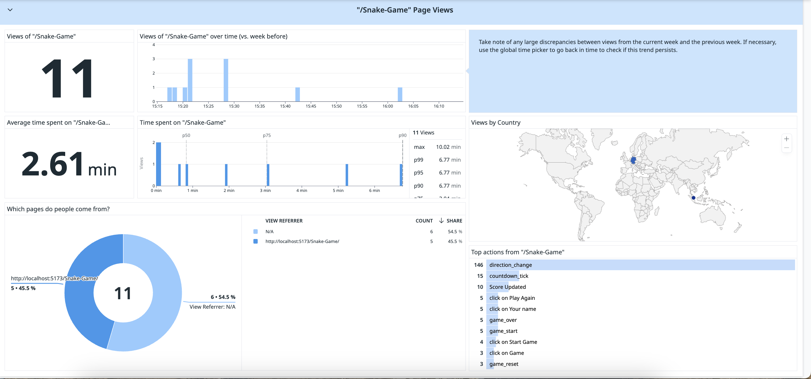

# Snake Game 🐍

Welcome to **Snake Game**, a fun, interactive, and highly optimized web-based game! This project is designed to showcase my expertise in **modern web development, real-time monitoring, and CI/CD automation**.  

The game features a **classic Snake gameplay experience** with a sleek **modern UI**, a **real-time leaderboard**, and **Datadog integration** for tracking performance and user interactions.  

## 🚀 Features  

✅ **Classic Snake Gameplay** – Nostalgic yet modernized for the web.  
✅ **Real-time Leaderboard** – Tracks high scores and persists game states with player names.  
✅ **Responsive Design** – Adapts seamlessly to mobile and desktop screens.  
✅ **Datadog Integration** – Monitors performance, user behavior, and logs custom metrics.  
✅ **Optimized with Vite & Tailwind CSS** – Ensuring fast builds and a beautiful UI.  
✅ **Automated CI/CD Pipeline** – Using GitHub Actions and Gradle for seamless deployment.  

---

## 🛠️ Technology Stack  

| **Technology**  | **Purpose** |
|---------------|------------|
| **React + TypeScript** | Component-based UI with static typing for maintainability. |
| **Vite** | Lightning-fast build tool for optimized development. |
| **Tailwind CSS** | Utility-first CSS framework for responsive design. |
| **Lucide-React** | Lightweight, modern icons for a sleek UI. |
| **Datadog RUM** | Real User Monitoring for tracking in-game actions. |
| **GitHub Actions** | Automates testing, building, and deployment. |
| **Gradle** | Efficient task execution and dependency management. |

---

## 🔧 Project Setup  

To get started, follow these steps:  

1️⃣ Clone the repository:  
```bash
git clone https://github.com/Pshar10/Snake-Game.git
```  
2️⃣ Navigate to the project directory:  
```bash
cd Snake-Game
```  
3️⃣ Install dependencies:  
```bash
npm install
```  

---

## 🚀 CI/CD Pipeline: Automated Build & Deployment  

This project is powered by **GitHub Actions** for seamless automation of **building and deploying** the game to **GitHub Pages**.  

### **🔄 Workflow Breakdown**  

1️⃣ **Trigger Events** – The pipeline runs automatically when:  
   - Code is pushed to the `main` branch.  
   - A pull request is made to `main`.  
   - Manually triggered via **workflow_dispatch**.  

2️⃣ **Build Process** –  
   - The workflow runs on **Ubuntu-latest**.  
   - Checks out the repository.  
   - Sets up **JDK 21 (Temurin)** to run Gradle tasks.  
   - Grants execution permission to the Gradle wrapper.  
   - Runs `./gradlew build` to compile the project.  
   - Uses **environment variables** (stored in GitHub Secrets) for **Datadog integration**.  
   - Uploads the built files as an **artifact** for deployment.  

3️⃣ **Deployment to GitHub Pages** –  
   - The `deploy` job fetches the **production build**.  
   - Uses **JamesIves/github-pages-deploy-action** to push the `dist/` folder to the `gh-pages` branch.  
   - The latest version of the game is instantly available online.  

---

## 🎮 Play Online!  

You can play the game **directly in your browser** without any setup:  

👉 **[Snake Game - Live Demo](https://pshar10.github.io/Snake-Game/)** 🐍🎉  

---

## 📸 Screenshots  

### 🎮 Gameplay  
  

### 📊 Datadog Monitoring  
  
  
  
  

---

## 💡 Why This Project?  

This project is a **demonstration of my ability to build high-performance web applications** with modern **frontend frameworks, CI/CD automation, and real-time analytics**.  

I built this game not just for fun but to highlight:  
✔️ My **expertise in React, TypeScript, and modern web development.**  
✔️ My **focus on monitoring and analytics using Datadog.**  
✔️ My **proficiency in setting up CI/CD pipelines with GitHub Actions & Gradle.**  

---

## 🤝 Contributing  

Want to improve the game? Feel free to contribute!  

Fork the repository, make your changes, and submit a **pull request**.  

---

## 📜 License  

This project is licensed under the **MIT License**.  

---

I hope you enjoy playing **Snake Game** as much as I enjoyed building it! 🎉🐍
